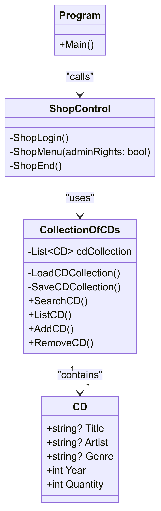

### Documentation for the first turn-in-assignment for CLO24  
## Student: Niklas Häll  
# Please see the Readme.md file for licence agreement
  
## Planning / concept:  
We are creating a software tool to help administrating a CD-enthusiast-shop.  
We have two employees with admin-rights and a guest-login for customers/enthusiasts.  
The software needs to be able to do the following:  
1) Add a CD  
2) Remove a CD  
3) Search for title, artist and/or genre  
  
Possible problem: How do we handle multiple copies of the same CD? (add "quantity" to the CD class?)  

## Classes and class-diagram:  
- Initial plan is to try to use the PlantUML extention in VS Code. Write the program in Visual Studio 2022, open the project folder in VS Code and then try to automaticly create the class diagram (and save as UML) via VSCode.  
- Updated / Added:  
- See attachments #1 and #2 at the end of this document  
  
## Concept / basic program layout:  
a) Feature: A main menu where we have the following:  
- Admin login (we will display a password so the tester can simulate admin tools)  
- Guest login (no pass required)  
- End: go back to log-in-screen OR end program  
  
b) Class: Main  
- contains menu / Update: this shortcuts to a method in the control-class instead, read section 'e'    
  
c) Class: CDcollection  
- searchCD  
- addCD  
- removeCD 
- CD-handling: Since we are not creating a real database, we will simulate this by using a List-function (as we will want to add/remove/etc. An Array is not an option). This is vital so we keep the information intact when the program is shut down!  
  
d) * Class: User - scrapped! better to keep the tools within the CD-class  
- admin (search, add, remove tools) / Update: moved to the ShopControl class    
- guest (search tool only) / Update: moved to the ShopControl class    
  
e) Class: ShopControl-class added later in the project
- It made more sense and had better control to keep all tools for handling CD and the List in the CDcollection-class, so I moved out the shop control tools into its own class. This way we also keep Main clean from clutter. 
  
## Clean Code:
- We will operate based on the Clean Code book by "Uncle Bob" (Rober C. Martin) as far as we can, which means we will try to do the following:  
- Methods will be put in sequential order, for reading visibility  
- We will name our variables and Methods based on what their function is  
- We will try to avoid unecessary nestling, this is one reason we prefer switch-cases over long if-sections even if they operate the same. Doing this is clearer to read and less risk of wasting resources in temporary memory.  

## Thoughts:   
- CDCollection only manage the collection  
- User ("guest", unless we create a real class for user handling as well! That could be an option to expand on in the future) only focus on user roles: do not mix responsibilites!  

## bool adminRights = false;  
This (having a bool setting for admin/guest control) entire concept has a few benefits:  
- It is easy to handle conceptually (Clean Code)  
- It needs no connection to a database or server, session control is a natural concept for databases but not here  
- Scalable: We can add more tools for admins without cluttering ShopMenu() with guest options!  
  
# Development phase one / version history:  
- Initial commit  
- Created CollectionOfCDs + User classes  
- Created basic ShopLogin()- and ShopEnd()-code  
- Updated ShopLogin() to handle admin/guest rights  
- Updated this document-file with the adminRight section above  
- Created basic code for the ShopMenu()-method  
- Added to the ShopEnd()-code  
- ShopMenu() added to, just need to be updated with the links to CD-methods when they are created  

# Next phase intro: Working the CollectionofCDs class:  
- Plan for implementation of a List where we can store the CDs, se below:  
1) I chose between creating this as a .txt, which would be easy to implement but is harder to structure (we would need to create comma-separated values), or to create this as a .json file. That would be easier to read/write data to - so I chose cdcollection.json  
2) I also decided to expand the class to include year of release and genre, as we want to search the class it seems like a good idea to have eras and genres! (plus, some albums could be a re-release with the same title)  
- Here I want to note that to see the files in Virtual Studio we have to shift+alt+a "add existing item" to see the documentation.md + cdcollection.json in solution explorer  

# Development phase two / version history:
- Added the List "CD", the relative file path and  
- ..also CollectionOfCDs-constructor, the primary role is to load LoadCDCollection, which is a method constructed to assist with handling loading the List (this we don't re-use code in the search/add/etc methods)  
- Added SaveCDCollection() to handle writing to file  
- Added NuGet Package: Newtonsoft.Json (required for Json serialization, which we want when we are loading/saving the Json file)  
- Added SearchCD()  
- Added ListCD()  
- Added AddCD() - it needs to go back to, to make validation checks  
- Created the CD class with getters and setters  
- Added RemoveCD()  
- Created the ShopControl()-class and moved all control methods there  

# Issues resolved  
- One major issue I had before is that a file path might be correct (in the program folder) but the program will still not find it. This happened this time again, with cdcollection.json. The solution is reasonable easy, if you had experienced this before, but I had to ask ChatGPT for guidance the first time. This is the solution: rightclick the file you cannot find (cdcollection.json in this case). Chose properties. Then on Copy to Output directory, chose "Copy always"! 
- Another major issue we had was that I could load the cdcollection.json file, we can add files while the console program runs but when the session (program) is shut down; the file only contains the original three files. Somehow it seems we can read, but not write, to it!  
- Steps undertaken to check this: Added a try-catch with debug message showing that the file is saved. It prints those CWLines so this indicates the pathing for storing or writing rights might be faulty?  
- One thought: We stored Artist + Title + Year when we add a CD, we do not store Quantity. This needs to be adjusted first. This was solved under AddCD() where we adjusted the cdCollection.Add- lines to end with Quantity = 1 (default value).   
- Added a CWLine "File path used {filePath} to make sure the file is stored correctedly. It was not stored the same place it is being loaded from! It ends up in \bin\Debug\net8.0 in the project folder for some reason - supposedly this a common issue, VS and other IDEs point to the \bin folder for debugging purposes..  
- Adjusted the executionassembly location (yes, extremely long shot solution!) but this way we can store and read from the same path.  

# Development phase three / version history:
- Intro: We have a working program now, so this phase is about tweaking, finding potential stack overflows, secure exception risks and simply to refine code
- Corrected nine (!) warnings of null value risks, this can be seen in SearchCD and RemoveCD()-methods in the if (searchTerm != null) checks  
- Adjusted the SearchCD method to sort result alphabetically. Using LINQ and OrderBy()  
- Since we included the above, we also use .Where and that means we now return and print out ALL matching searches, not just the first hit. This resolves the potential problem if our search would match multiple items but only return the first.  
- Adjusted the AddCD() method to check if CDs already exist in the collection, and if so, to adjust Quantity by +1 instead of adding another item. To do this, we used the FirstOrDefault search to return all CDs where Title, Artist and Year (if different releases!) would be the same.  
- Adjusted the AddCD() method to loop back in case the user input is invalid. One do-while loop handles the three string inputs, then the int input is validated in a separated while-loop afterwards.  
- Corrected three null reference warnings (CS8604) that arose when I adjusted the SearchCD method. I was using a null-conditional operator (single ?), but the solution was to adjust the code to a null-coalescing operator (double ??). 
- Deployed a similar LINQ-function to the ListCD()-method as we had on SearchCD. Listing them alphabetically there as well.  
- Added the NuGet package ConsoleTables. It prints a nice frame around the List-table.  
- Completed the code for the release-version.  
  
# Potential issues and solutions
- When we search for existing CDs to match, we could have a potential problem since we do not search for Genre. This is a tough nut to crack as it has potential issues both ways:  
- Genre is a subjective value, the user that puts in that value will set her or his own personal take on it. This could cause problem both when adding, or when searching, for items. There is multiple solutions for this:  
- One would simply be to remove genre as a value  
- Another would be to suggest genres and have a selected list that would be (hopefully) blantantly obvoious. I used this mechanic for a movie database I wrote, but then I had drop down menus and a SQL database, now we're working with a List and a console application.  
- A third solution would be to try to add as many albums as we can, with genres preset, and set their quantity to "zero". This way we would just add albums to existing items.  
- For now, all of this is put to the to-do list to be considered for the future  
  
# To Do:  
- Intro: This list will contain additions I want to see to the program. Some might not make the cut before the release version, in that case they are considered "future upgrades". Otherwise we just remove the items one by one from this list as they are added (or discarded as ideas) to the program.  
  
- Class-diagram! Added to this file! High prio.    

Potential "future upgrades":  
- Consider changing .ToLower to better handle international characters  
- Consider Genre and the various solutions.  
- Class: User - add this and create user logins + a list to handle them. This is very, very, very far down the work list so it is considered a bonus or future update  
  
## Attachments and references
1) UML-class diagram below:  
  
classDiagram
    class Program {
        +Main()
    }

    class ShopControl {
        -ShopLogin()
        -ShopMenu(adminRights: bool)
        -ShopEnd()
    }

    class CollectionOfCDs {
        -List~CD~ cdCollection
        -LoadCDCollection()
        -SaveCDCollection()
        +SearchCD()
        +ListCD()
        +AddCD()
        +RemoveCD()
    }

    class CD {
        +string? Title
        +string? Artist
        +string? Genre
        +int Year
        +int Quantity
    }

    Program --> ShopControl : "calls"
    ShopControl --> CollectionOfCDs : "uses"
    CollectionOfCDs "1" --> "*" CD : "contains"

2) Class diagram image below:  
  

3) Reference: UML + Class diagram created with following tools:  
- UML code generated by asking ChatGPT to create it based on the project code  
- Class diagram png created through Mermaidchart (directly copied from ChatGPT through the Mermaid Chart-GPT)  